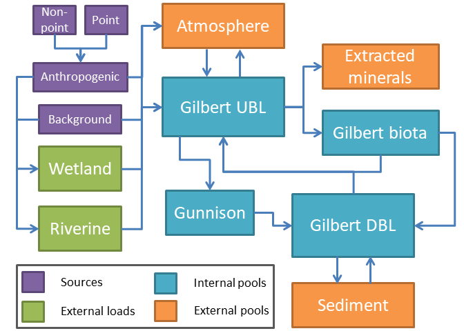

# (PART) Nutrient pools & loads {-}

# Concept & methods {#concept-methods}
## Nutrients in GSL
Nutrient concentrations are an important component of the Great Salt Lake ecoystem, influencing the diversity, abundance, and biomass of resident biota. Nutrients are contributed to the lake from both 
natural and anthropogenic sources. Given the terminal nature of GSL, characterizing the nutrient budget for GSL is somewhat unique relative to other lakes.

Conceptually, the GSL nutrient budget can be broken down into three parts:  
1. External loads  
2. Internal pools  
3. External pools  

The frequency and magnitude of exchanges among these components, coupled with the water volume of the lake, determines nutrient concentrations in the lake. 


```{r, out.width='90%', fig.align="center", fig.cap='GSL nutrient loads and pools conceptual diagram.', echo=F}

```

## Methods
The analyses described in this chapter generally follow the methods of Naftz 2017 to estimate both nutrient pools in and loads to Gilbert Bay of GSL. These estimates are currently restricted to Gilbert Bay 
largely due to the availability of nutrient concentration and discharge data making such estimates logistically feasible for Gilbert Bay and impractical for other portions of the lake. Pools in Gilbert Bay 
were estimated for both the upper brine layer (UBL) and the deep brine layer (DBL). Loads to Gilbert Bay were estimated at four important inflows to Gilbert Bay: the Bear River Bay inflow, the Farmington Bay inflow, 
the Weber River, and the Goggin Drain. Nutrient exchanges at the UPRR causeway bridge were not included here due to a lack of discharge data availability at this time. 
The objective of these analyses was to replicate and expand on the work of Naftz 2017 while also generalizing and automating the process to include multiple constituents and 
a wider spatial and temporal dataset. As such, the core methods are only generalized here with important deviations noted.  

All data included in these analyses are publically available from either USGS NWIS or EPA WQP.

### Gilbert Bay nutrient pool estimates
Nutrient concentrations were estimated for Gilbert Bay by aggregating samples collected from the upper and deep brine layers to mean monthly values. DBL samples were defined as those occurring at sites 405356112205601 or 410644112382601 
and with sampling depth >= 5 meters (see map). UBL samples were defined as any sample in Gilbert Bay <= 2 meters sampling depth. Gilbert Bay brine layer volumes were estimated from observed Gilbert Bay elevations via formulas presented in 
Naftz 2017. DBL and UBL nutrient pool masses were estimated by multiplying the mean monthly concentrations by mean monthly water volume estimates. There are two main differences between these estimates and the original estimates of Naftz 2017.
First, these estimates include samples collected at any site in Gilbert Bay whereas the Naftz 2017 estimates were restricted to a subset of site locations. Second, Naftz 2017 filled gaps in sample availability by rolling forward the concentrations 
observed at a site in a previous month. This process was not performed in this analysis.  
  
The estimates from this process were then compared to those produced in Naftz 2017 as a validation step, and then the same methods were applied to both total and dissolved nitrogen and phosphorus as well as salinity to 
generate estimates for all constituents.

### Gilbert Bay nutrient load estimates
Nutrient loads for the four locations were estimated at a daily timestep from daily mean concentrations paired with daily mean discharge values using USGS loadest (package rloadest). Discharge values at the Bear River Bay 
outflow were estimated by a regression equation from the Bear River at Corinne gauge following Naftz 2017. The rloadest function selBestModel() was used to select the best model for each constituent and site. The models 
were then applied back to the calibration dataset to generate daily flux estimates which were then aggregated to an annual load. The primary difference in methods here between these analyses and the Naftz 2017 
analyses is the longer dataset available for calibrating the loading models. Records associated with negative discharge values (which only occurred at FB outflow site) were removed before calculating loads. 
However this does generate the potential for 'double-counting' some amount of nutrient inputs at the FB site. 
It is unclear how Naftz 2017 dealt with negative discharge values.


